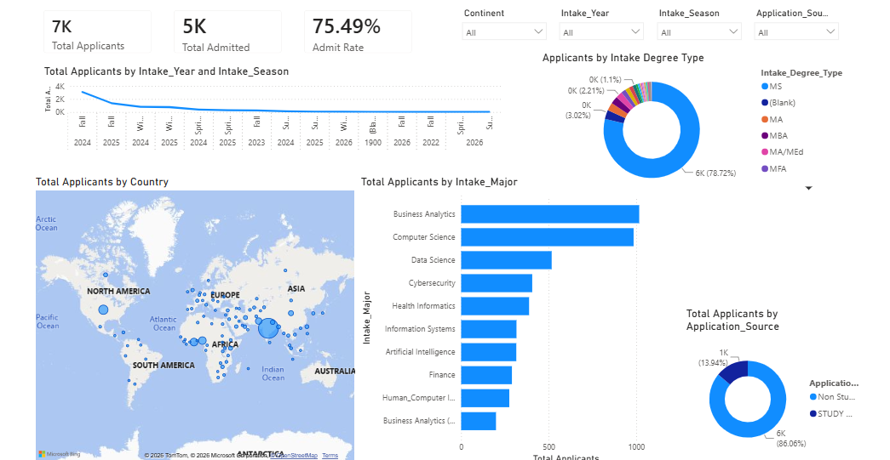
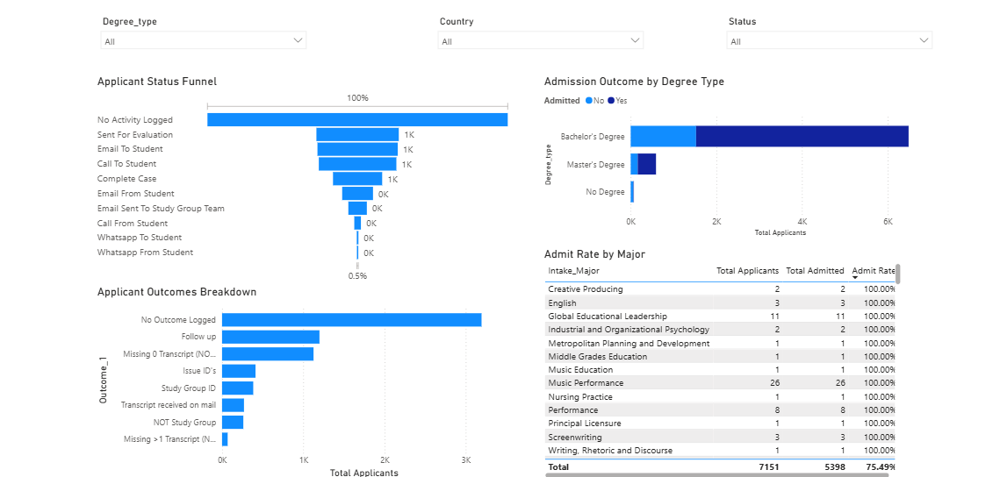
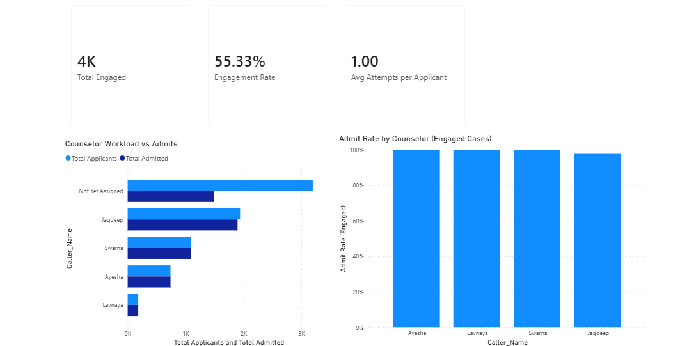

# 🎓 DePaul University Graduate Admissions Analytics

This project analyses the graduate admissions pipeline for **DePaul University** using **Microsoft Excel** and **Power BI**, transforming raw applicant data into an interactive dashboard that provides insights into recruitment performance, admissions outcomes, and counselor engagement. The project follows a complete analytics workflow including exploratory data analysis, data cleaning, feature engineering, dashboard development, and business recommendations.

---

## 🔍 Overview

This project demonstrates an end-to-end data analytics process by exploring, cleaning, transforming, and visualising graduate admissions data. The final deliverable is a three-page interactive Power BI dashboard that enables stakeholders to monitor recruitment activities, evaluate admissions performance, and assess counselor engagement through dynamic filtering and drill-down capabilities.

---

## 🔄 Project Workflow

```text
Raw Dataset
      │
      ▼
Data Exploration (EDA)
      │
      ▼
Data Cleaning & Feature Engineering
      │
      ▼
Power BI Data Modelling
      │
      ▼
DAX Measures
      │
      ▼
Interactive Dashboard
      │
      ▼
Business Insights & Recommendations
```

---

## 📌 Objectives

- Analyse graduate applicant demographics and recruitment trends.
- Improve dataset quality through comprehensive data cleaning and feature engineering.
- Develop an interactive dashboard for admissions monitoring.
- Identify key recruitment, admissions, and counselor engagement patterns.
- Generate actionable recommendations to support data-driven enrollment decisions.

---

## ❓ Business Questions

- How many applicants were admitted, and what is the overall admit rate?
- Which countries contribute the highest number of applicants?
- Which academic programs receive the highest application volumes?
- How does counselor engagement influence admission outcomes?
- What are the major bottlenecks within the admissions process?
- Which recruitment channels generate the most applicants?

---

## 📚 Dataset Description

- **Source:** DePaul University Graduate Applicant Dataset
- **Initial Dataset:** 7,543 records × 80 columns
- **Cleaned Dataset:** 7,529 records × 20 columns
- **Final Dashboard Dataset:** 7,151 graduate applicant records
- **Key Fields Include:**
  - Country
  - Application Source
  - Degree Type
  - Intake
  - Course
  - Admission Status
  - Counselor
  - Engagement Status
  - Applicant Outcomes

---

## 🛠 Tools & Technologies Used

- Microsoft Power BI
- Power Query
- DAX
- Microsoft Excel
- Data Cleaning & Feature Engineering

---

## 💼 Skills Demonstrated

- Data Cleaning & Transformation
- Data Validation
- Feature Engineering
- Exploratory Data Analysis (EDA)
- Data Modelling
- DAX Measure Development
- Interactive Dashboard Design
- KPI Development
- Admissions Funnel Analysis
- Recruitment Analytics
- Geographic Data Visualisation
- Business Intelligence Reporting
- Data Storytelling
- Insight Generation
- Business Recommendation Development
- Power BI Slicers & Cross-filtering
- Performance Monitoring Dashboard Design

---

## 🧹 Data Cleaning Process

The raw dataset required extensive preparation before analysis.

### Key Cleaning Activities

- Removed **38 columns** containing 100% missing values.
- Removed irrelevant identifier and timestamp columns.
- Eliminated records with missing Country and Intake values.
- Split the **Intake** field into:
  - Education Level
  - Season
  - Month & Year
  - Course
- Standardised categorical values.
- Replaced missing College values with **"Unknown"**.
- Reduced the dataset from **80 columns to 20 analytical variables** while preserving over **99.8%** of observations.

---

# 📈 Dashboard Highlights

## 1️⃣ Recruitment Overview

The dashboard provides a high-level summary of recruitment performance through KPI cards and interactive visuals.

### Dashboard Features

- Total Applicants
- Total Admitted
- Admit Rate
- Country Distribution
- Application Sources
- Degree Types
- Applicant Trends over Time

### Dashboard Preview



---

## 2️⃣ Admissions Funnel

The admissions dashboard visualises the applicant journey from application through admission, making it easy to identify process bottlenecks.

### Dashboard Features

- Admissions Funnel
- Admission Outcome by Degree Type
- Admit Rate by Major
- Outcome Distribution
- Interactive Filters
  - Country
  - Year
  - Season
  - Degree Type
  - Application Source

### Dashboard Preview



---

## 3️⃣ Counselor Engagement

This page evaluates counselor activity and its relationship with admissions success.

### Dashboard Features

- Counselor Workload
- Engagement KPIs
- Admit Rate by Counselor
- Average Contact Attempts
- Average Days from Contact to Admission

### Dashboard Preview



---

# 💡 Key Insights

### 1. Strong Admissions Performance

The university admitted **5,398** out of **7,151** applicants, resulting in an overall **75.5% admission rate**, demonstrating a highly effective admissions pipeline.

---

### 2. Recruitment is Highly Concentrated

India contributes **61%** of all applications, making it the institution's primary recruitment market. This highlights both a strong international presence and an opportunity to diversify recruitment efforts.

---

### 3. Technology Programs Lead Demand

Business Analytics and Computer Science attract the largest share of graduate applications, reflecting increasing demand for technology-focused programmes.

---

### 4. Counselor Engagement Significantly Improves Admissions

Applicants who received counselor engagement achieved an admission rate of **98.8%**, compared to only **46.6%** for applicants without recorded engagement.

This represents the strongest relationship discovered throughout the analysis.

---

### 5. Nearly Half of Applicants Remain Unengaged

Approximately **45%** of applicants had no recorded counselor interaction, representing the largest opportunity to improve overall admissions performance.

---

### 6. Admissions Process Bottlenecks

The leading causes of stalled applications are:

- Missing Transcript
- Follow-up Required

Together, these account for more than **2,300** delayed applications.

---

# 💡 Insights & Recommendations

- Diversify recruitment efforts beyond India to reduce geographic concentration risk.
- Continue investing in high-demand programmes such as Business Analytics and Computer Science.
- Prioritise counselor assignment for applicants with no recorded engagement.
- Rebalance counselor workloads to improve response times.
- Reduce transcript-related delays through automated reminders and document tracking.
- Establish service-level targets for first applicant contact to improve conversion rates.
- Monitor recruitment channel performance to optimise marketing investment.
- Continue tracking counselor engagement metrics to improve admissions outcomes.

---

## 📊 Dashboard Features

- ✔ Interactive KPI Cards
- ✔ Recruitment Overview Dashboard
- ✔ Admissions Funnel Analysis
- ✔ Counselor Performance Dashboard
- ✔ Geographic Applicant Mapping
- ✔ Dynamic Filtering with Slicers
- ✔ Cross-filtering Between Visuals
- ✔ Drill-down Capabilities
- ✔ DAX Measures
- ✔ Interactive Maps
- ✔ Funnel Charts
- ✔ Business KPI Monitoring

---

## 📂 Repository Structure

```text
International-Student-Recruitment-Analytics/
│
├── 01-Project-Documentation/
│   ├── Week-1-Data-Exploration-and-EDA-Report.pdf
│   ├── Week-2-Data-Cleaning-and-Quality-Report.pdf
│   └── Week-3-Dashboard-Development-and-Insights-Report.pdf
│
├── 02-Datasets/
│   ├── 01-Raw-Data.csv
│   ├── 02-Cleaned-Data.xlsx
│   └── 03-Data-Dictionary.pdf
│
├── 03-Excel/
│   └── Analysis.xlsx
│
├── 04-Power-BI/
│   ├── Dashboard.pbix
│   └── Dashboard.pdf
│
├── 05-Final-Presentation/
│   ├── Week-4-Final-Presentation.pdf
│   └── Week-4-Final-Presentation.pptx
│
├── Images/
│   ├── Recruitment-Overview.png
│   ├── Admissions-Funnels.png
│   └── Counselor-Engagement.png
│
└── README.md
```

---

## 📒 Project Files

- **📊 Interactive Power BI Dashboard**  
  [*Open Power BI Service link*](https://app.powerbi.com/view?r=eyJrIjoiMGMwNzUwZTAtOGE1MS00ZTkyLWI1ZDItN2UwYWY3YjViODA3IiwidCI6IjgzMDQ2NGFmLTgwOWEtNDgxYS1iMjE1LTgyNTU5ZWRmYWI2MiJ9)

- **💻 Power BI (.pbix) File**  
  [*Open Power BI file*](https://github.com/Adaeze-Jennifer/EXCELERATE-GLOBAL-INTERNSHIP-PROJECTS/blob/main/International%20Student%20Recruitment%20Analytics/04-Power-BI/Dashboard.pbix)

- **📄 Week 1 – Exploratory Data Analysis Report**  
  [*View PDF*](https://github.com/Adaeze-Jennifer/EXCELERATE-GLOBAL-INTERNSHIP-PROJECTS/blob/main/International%20Student%20Recruitment%20Analytics/01-Project-Documentation/Week-1-Data-Exploration-and-EDA-Report.pdf)

- **🧹 Week 2 – Data Cleaning & Quality Report**  
  [*View PDF*](https://github.com/Adaeze-Jennifer/EXCELERATE-GLOBAL-INTERNSHIP-PROJECTS/blob/main/International%20Student%20Recruitment%20Analytics/01-Project-Documentation/Week-2-Data-Cleaning-and-Quality-Report.pdf)

- **📈 Week 3 – Dashboard Development & Insights Report**  
  [*View PDF*](https://github.com/Adaeze-Jennifer/EXCELERATE-GLOBAL-INTERNSHIP-PROJECTS/blob/main/International%20Student%20Recruitment%20Analytics/01-Project-Documentation/Week-3-Dashboard-Development-and-Insights-Report.pdf)

- **⬆ Back to Top**  
  [DePaul University Graduate Admissions Analytics Dashboard](#-depaul-university-graduate-admissions-analytics)

---

## ⭐ If you found this project interesting, consider giving the repository a star!
